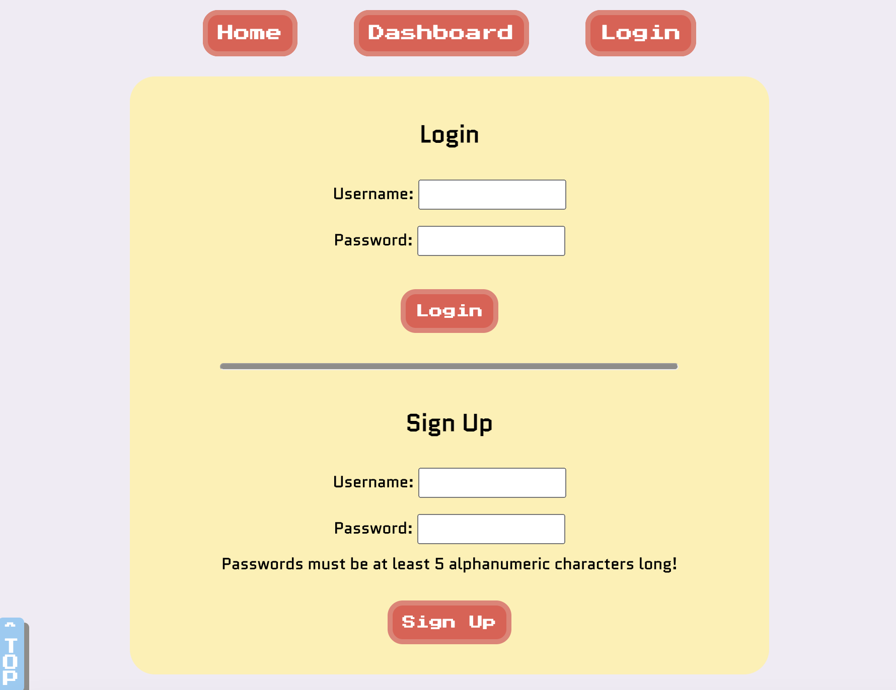
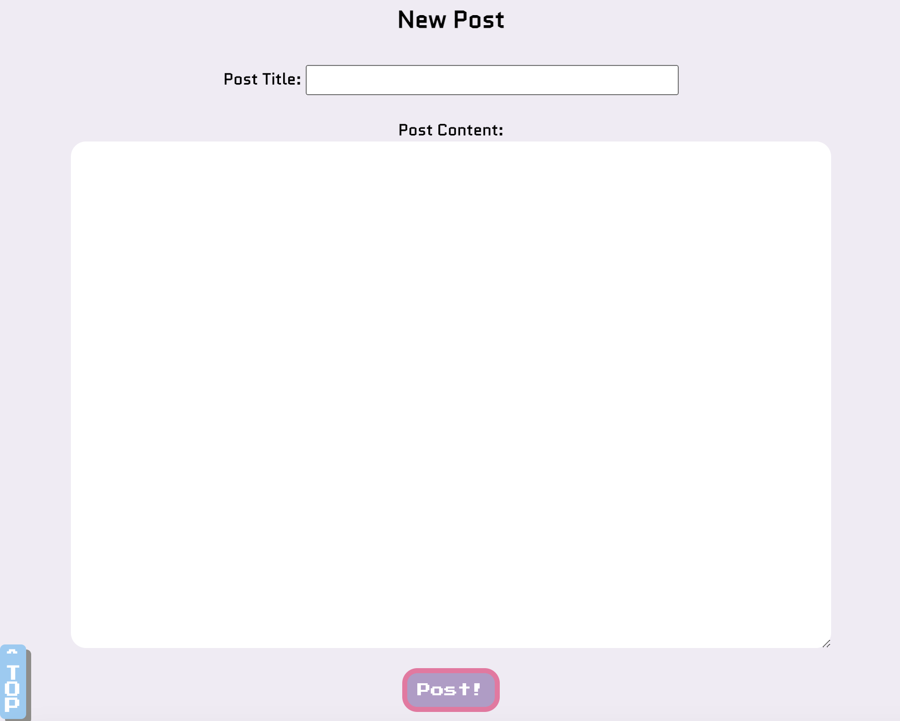
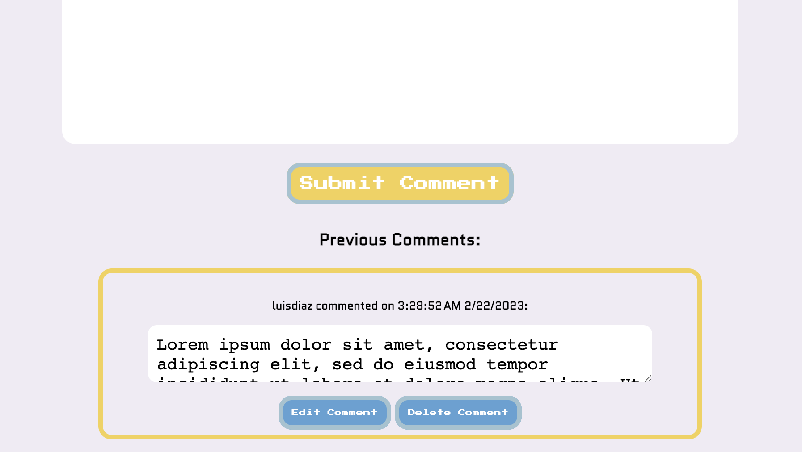

# Tech Blog 

  ## <a id="Description">Description</a> 

  This is a technology blog site built with node.js, in the Controller-Model-View structure, with the help of express, express-session, sequelized, mysql2, bcrypt, and dotenv packages, and handlebars for page rendering.

  Upon arriving on the homepage. The user is presented with the Home button, the Dashboard button, and the Login button, followed by the listing of currently existing blog posts, their titles, authors, and date and time the posts were created. If the user clicks on any other buttons than the Home button, the user is brought to the login/sign-up page, where the user can either log in or sign up with their username and password.

  Upon successful login/sign-up, the user is brought back to the homepage but is now able to click on the "Read More" button under each blog listing to view the complete blog post. When the user clicks on a blog post to read more, the user is brought to the page where he can read the complete blog post, followed by a section to post comments on the blog post, and then a section where previous comments on the blogpost are listed along with the commenters' usernames and the date and time the comments were posted. If a particular comment was posted by the user, the comment will be presented with the "Edit Comment" and "Delete Comment" buttons below it, so that he can edit or delete his own comment. Clicking on the edit button will disable the textarea's readonly attribute so that the user can modify their comment. After the user finishes editing his comment, he can click on the "Update Comment" button to save the comment. 

  When the user clicks on the dashboard button, he is takend to the page with the "Create New Blog Post" button on top, followed by a section where the user's previous blog posts are listed. When the user clicks on the new post button, the blog post form will apprear for the user to fill in the blog title and blog content. Once the user is done with the new entry, he can click on the "Post" button below the form, and he will be brough back to the dashboard page with the new post added to the list of the user's previous posts. When the user clicks on one of his own blog posts, he can click on the "Edit Post" or "Delete Post" button at the bottom of the post. The edit button allows the user to modify the post title and content before clicking on "Update Post" to save the title/content and be taken back to the dashboard. The delete button removes the post altogether before taking the user back to the dashboard.

  The Logout button will sign the currently user out and take him back to the homepage. If at any point the user is idle on the site for too long and the cookies has timed out, the user can still finish reading blog posts or comments, but if he clicks on any buttons to edit/delete a post/comment, he will be brought to the login page to re-login before he can perform those tasks. 

  This site is made for both wide and narrow viewports.

  The URL of the deployed app on Heroku: https://freds-tech-blog.herokuapp.com/

  The URL of the Github repo is: https://github.com/FeddericoWayne/Tech-Blog

  
  Homepage screenshot:
  

  Login/ Sign Up Page screenshot:
  

  Dashboard screenshot:
  

  New Post Page screenshot:
  

  Edit Post/ Delete Post/ Comment Section screenshot:
  

  Edit/ Delete Comment screenshot:
  

***

  ## Table of Content

  ### [Description](#Description)
  ### [Installation](#Installation)
  ### [Usage](#Usage)
  ### [License](#License)
  ### [Contributing](#Contributing)
  ### [Tests](#Tests)
  ### [Questions](#Questions)

***

  ## <a id="Installation">Installation</a>

  No installation is needed. Follow the instructions in the Description section of this README to post technology-related content and interact with other users in the comment section.

***

  ## <a id="Usage">Usage</a>

  This App is a blog for people to post about everything technology.

***

  ## <a id="License">License</a>
  
  This App is covered under the MIT license.

  
***

  ## <a id="Contributing">Contributing</a>

  Please refer to the Question section of this README for my contact information if you'd like to contribute to this project!

***

  ## <a id="Tests">Tests</a>

  N/A
  

***

  ## <a id="Questions">Questions</a>

  For more info on my work, please check out my GitHub page at: https://github.com/feddericowayne
  
  Should you have any further questions regarding this App, please don't hesitate to reach out to me via email at: <a href="mailto:jackiew1120@hotmail.com">jackiew1120@hotmail.com</a>

  